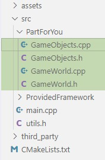
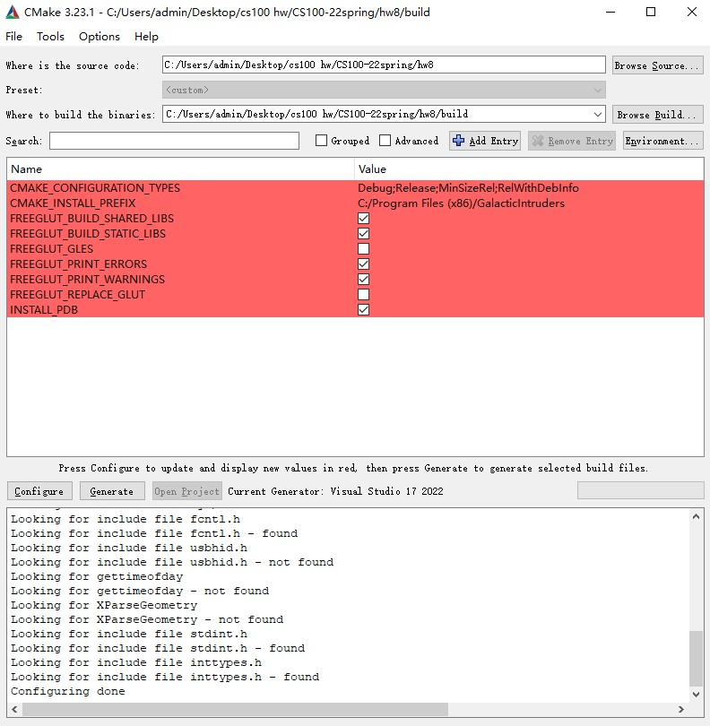
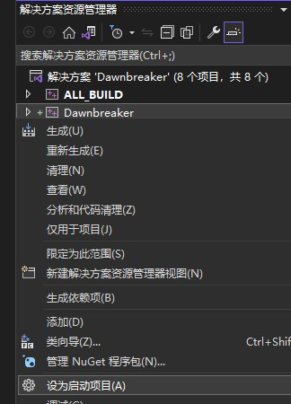

[⭐ 致参加beta测试的各位 3](#-致参加beta测试的各位)

[⭐ 故事 3](#-故事)

[⭐ 20页？是不是疯了？ 4](#-20页是不是疯了)

[⭐ 游戏是如何运作的 4](#-游戏是如何运作的)

[⭐ 好的，所以这么多东西我怎么写？ 5](#-好的所以这么多东西我怎么写)

[⭐ 在GameWorld类中管理你的游戏 5](#-在gameworld类中管理你的游戏)

[⭐ Init() 7](#-init)

[⭐ Update() 7](#-update)

[⭐ CleanUp() 8](#-cleanup)

[⭐ 从GameObject基类开始创建每种游戏对象 8](#-从gameobject基类开始创建每种游戏对象)

[⭐ 破晓号(Dawnbreaker) 10](#-破晓号dawnbreaker)

[⭐ 当被创建时 10](#-当被创建时)

[⭐ 当Update()时 10](#-当update时)

[⭐ 当发生撞击时 11](#-当发生撞击时)

[⭐ 星星(Star) 11](#-星星star)

[⭐ 当被创建时 11](#-当被创建时-1)

[⭐ 当Update()时 12](#-当update时-1)

[⭐ 爆炸(Explosion) 12](#-爆炸explosion)

[⭐ 当被创建时 12](#-当被创建时-2)

[⭐ 当Update()时 12](#-当update时-2)

[⭐ 蓝色子弹(Blue Bullet) 12](#-蓝色子弹blue-bullet)

[⭐ 当被创建时 12](#-当被创建时-3)

[⭐ 当Update()时 12](#-当update时-3)

[⭐ 陨石(Meteor) 13](#-陨石meteor)

[⭐ 当被创建时 13](#-当被创建时-4)

[⭐ 当Update()时 13](#-当update时-4)

[⭐ 红色子弹(Red Bullet) 13](#-红色子弹red-bullet)

[⭐ 当被创建时 13](#-当被创建时-5)

[⭐ 当Update()时 14](#-当update时-5)

[⭐ 阿尔法号(Alphatron) 14](#-阿尔法号alphatron)

[⭐ 当被创建时 14](#-当被创建时-6)

[⭐ 当Update()时： 15](#-当update时-6)

[⭐ 当被击毁时 16](#-当被击毁时)

[⭐ 西格玛号(Sigmatron) 16](#-西格玛号sigmatron)

[⭐ 当被创建时 16](#-当被创建时-7)

[⭐ 当Update()时： 16](#-当update时-7)

[⭐ 当被击毁时 17](#-当被击毁时-1)

[⭐ 欧米茄号(Omegatron) 17](#-欧米茄号omegatron)

[⭐ 当被创建时 17](#-当被创建时-8)

[⭐ 当Update()时： 18](#-当update时-8)

[⭐ 当被击毁时 19](#-当被击毁时-2)

[⭐ HP回复道具(HpRestoreGoodie) 19](#-hp回复道具hprestoregoodie)

[⭐ 当被创建时 19](#-当被创建时-9)

[⭐ 当Update()时 19](#-当update时-9)

[⭐ 升级道具(PowerUpGoodie) 20](#-升级道具powerupgoodie)

[⭐ 当被创建时 20](#-当被创建时-10)

[⭐ 当Update()时 20](#-当update时-10)

[⭐ 陨石道具(MeteorGoodie) 20](#-陨石道具meteorgoodie)

[⭐ 当被创建时 20](#-当被创建时-11)

[⭐ 当Update()时 20](#-当update时-11)

[⭐ 附录（有很多部分没写） 22](#-附录有很多部分没写)

[⭐ 碰撞处理 22](#-碰撞处理)

[⭐ 关于项目 22](#-关于项目)

[⭐ Windows下首次运行 22](#-windows下首次运行)

[⭐ MacOS下首次运行 23](#-macos下首次运行)

[⭐ 致谢 24](#-致谢)

# ⭐ 致参加beta测试的各位

非常感谢你们愿意帮助我们在正式发布前测试这个作业！既然各位本身是出于自愿，我们不会有任何必须要做的进度要求：你们可以自由选择在正式发布前要做多少内容。即使你只做了一部分中的一部分，我们也会非常感谢你的出力。

作为 beta 测试，我们暂时还不能提供评测脚本，也不对你们实现的正确性做要求。我们希望的是通过你们的体验来确定、调整这两次作业的难度。因此，希望大家能够非常模糊地大致记录一下你在每个进度上花费的时间和你认为复杂/困难的部分，比如说，你花费3 个多小时做完了 HW8 部分，两个小时做完了阿尔法号敌机……诸如此类。通过你的数据，我们可以最终决定是否要删改

一些内容等等。希望能更直观地看到这个作业的负担和难度，而不是直到作业发布还在纸上谈兵。

# ⭐ 故事

三个月前，你拿到了梦寐以求的 TakuGames 公司的实习 offer。

成为一名游戏开发人员是你一直以来的梦想。你打算好好珍惜这次机会。

你下定决心，只身一人接下了公司中一个代号叫“破晓”的游戏项目。老板赞叹于你的勇气，认为若你有完成这个项目的能力，未来必将成为他的心膂股肱。你信心满满。

一路克服了数不清的难题，这个项目也日趋完善。终于，你在屏幕上的代码中看到了，破晓的曙光。你有一种预感，就是今天了——

但你实现的最后一项功能触发了你未曾察觉的巨大 bug，整个游戏都无法运行。已是深夜，你也越发烦躁。你在桌边备好一整壶咖啡用于提神，然后决定从最底层开始寻找bug的来源。

窗外已是破晓。当你终于重新看到游戏画面之后，你如释重负。从高度紧张的状态走出，你立刻倒在屏幕前睡了过去。

然而当你醒来时，你发现咖啡壶被你在睡梦中碰翻，咖啡全部洒进了桌下的机箱里。无法开机。你拆开机箱，拿出储存数据的硬盘，它的SATA 接口处还能滴出几滴咖啡。你把它转接到笔记本电脑上，它已经无法被电脑识别。

你意识到你完全没有做任何离线/在线备份，你万念俱灰。愤怒涌入了你的头脑——你用几乎要把这只硬盘的外壳捏碎的力量，将它扔出了22楼的窗外。

突然，你想到还有公司的电脑：因为疫情，这一个月你一直居家办公。你连接到公司的电脑，这个项目的进度止步于一个月之前刚搭好的第一版游戏引擎。你从回收站里找到了第一版“破晓” 的策划案和演示程序，因为你觉得能做得更好，当时立即否定了这一版。

还有希望，你对自己说。截止日期临近了，这是你的最后机会。你充满了决心。你再次打开了策划案，不由自主地默读了起来：

“代号‘破晓’（初版）是一款2D纵向卷轴飞行射击游戏，在游戏中，你将需要操控‘破晓号’ 飞船，保卫你的太空基地，抵挡外星飞船‘阿尔法号’‘西格玛号’‘欧米茄号’的入侵……”

# ⭐ 20页？是不是疯了？

\<还没写\>

这里需要大家的协力！我们希望用 beta 测试的大家的数据来告诉学生，这个项目有没有看起来那么吓人，难度如何，做完哪些部分要花多长时间。

另外，在这个作业介绍的后半部分，每个游戏对象的细节说明里，我们故意做了很多不必要的文字重复，导致这篇文档长达20多页。这是因为我们希望你能够从这些重复的内容里提取出不同对象之间的共同点与区分点，在自己的设计中将共同点写在共有的基类里，降低代码的冗余和错误率，而不是被我们用我们设计的结构来“教你做事”。

# ⭐ 游戏是如何运作的

你所看到的不断刷新的游戏界面其实也是一个逐帧播放的视频。在游戏中，一帧(frame)的时长被称为一刻(tick)。一刻即为游戏内部的一个周期。在这个周期中，游戏中所有内容的状态都会被更新，然后再被显示到游戏界面上。理想状态下，我们希望游戏运行中每一刻(tick)的时间是恒定的，比如每秒60帧，但每一帧内不同的游戏内容可能会导致游戏以稍微不稳定的速率运行。 面向对象编程(OOP)的思想在游戏中被广泛应用。我们可以将这个游戏的所有组成成分（破晓号、蓝色子弹、敌人、道具，甚至还包括背景中的星星）都抽象成一个个“游戏对象”(GameObject)。既然成为了一个C++中的对象，那么它便可以用成员变量(member variables)来储存属于自己的信息（比如所在的x, y坐标、剩余的HP[^1]等），也可以用成员函数(member functions)来定义自己应当做的行为（比如一架“西格玛号”如何飞行、或是一架“欧米茄号”如何决定在被击毁时掉落什么道具）。

[^1]: 实际上，HP来源于 Hit Point 的缩写，而不是大家更广泛以为的 Health Point。历史上的很多简单游戏中，每受到一次打击，玩家就会减少一点 Hit Point，直至失去所有 HP 游戏结束。而随着 Hit Point 不再以一次一点为单位而开始细分，大家逐渐更认可 Health Point 的说法，正如我们也会将它叫做“生命值”或“血量”一样。

我们刚刚提到过，在每一刻里，游戏的所有内容都会更新。在我们的游戏里，这一行为实现在了 Update() 函数中。在一刻的时间中，我们可以让所有的游戏对象(GameObject)都执行一次 Update()函数。不同的对象对这个函数的内容需要各有实现：背景中的一颗星星可能只需要向下移动一个像素从而让画面看起来像是在运动，而破晓号需要确定向哪个方向移动或者是否要发射一枚子弹。

当所有游戏对象(GameObject)都进行了一次 Update() 后，我们的游戏就应当把新的状态显示在屏幕上。原有的上一帧的游戏显示将会被清除，然后再根据每个游戏对象 Update() 更新过的状态（比如移动后的所在位置），重新将所有游戏对象再画出来。在一次 Update() 中，游戏对象通常不会移动太大的距离，从而使 Update 与显示不断循环下的游戏界面看起来像是平滑的动画。

我们的游戏中还存在独立的关卡。一个关卡的流程可以细分为以下三步：

-   初始化:当你开始新的一关时，游戏内的某些信息需要初始化，同时在关卡开始时也有一些游戏对象（比如你的破晓号）被添加进游戏。
-   游戏过程：即上面描述的Update()与显示的不断循环。在这个过程中，可能有新的游戏对象加进游戏（如刚发出的子弹），也可能有已有的游戏对象被删除（被击毁的阿尔法号、飞出屏幕的子弹和星星等）
-   清理：当游戏过程中检测到玩家胜利或者失败，当前的关卡就会结束。这时，你需要首先对关卡进行清理：即删除关卡内所有的游戏对象，以免有动态分配的内存没有被释放。如果玩家在这一关卡中胜利，那么游戏会进入下一关卡的初始化环节。如果玩家失败但还有剩余的生命数，则会重新开始这一关（同样，从初始化开始）。如果玩家失去了所有的生命数，就显示游戏结束画面，然后退出游戏。

# ⭐ 好的，所以这么多东西我怎么写？

接下来的\<?\>页将包含在“破晓”中你需要实现的所有内容的细节说明。如果你现在就想打开你的项目，请先阅读一下附录中的CMake指南。

可想而知，从零开始写出一个完整的游戏绝不是能一蹴而就的小工程。“破晓”中内容较多，需要逐步完成。因此，作业会将所有内容按推荐的实现顺序拆分为两个部分，分别作为HW8与HW9。在以下的细节说明中，蓝色字体的项目表示推荐先实现，并且HW8中必须完成的部分，但这并不意味着黑色字体可以跳过。对本游戏的重要基础介绍同样为黑色字体。我们建议你先阅读完整的题目说明，对这个游戏基本了解，之后再开始写码。写码时则可以从蓝色字体部分开始逐步开工。有关于两次作业提交的更多细节，详见\<还没写\>。

提供的所有文件的结构如图所示：



在这些文件之中，你只允许修改 src/PartForYou 路径下的四个文件。若通过修改其余部分

（如提供的框架）代码实现了需要的功能，会无法正常通过评测。

# ⭐ 在GameWorld类中管理你的游戏

GameWorld类就是你的游戏世界的缩影。在你的游戏中，无论是开始或结束一个关卡、添加或删除一个游戏对象，还是处理游戏对象之间的互动（子弹打到敌方飞船），都在GameWorld类中完成。因此，GameWorld类最重要的功能便是储存和管理游戏对象。你的GameWorld类中需要有一个储存游戏对象的容器。你允许使用任何标准模板库(STL)容器，但我们非常建议你使用std::list。它内部的链表结构使它适用于需要频繁地添加或删除的应用场景，同时std::list还支持在使用迭代器(iterator)遍历的同时添加或删除元素，游戏中某些步骤可能需要此功能。（例如，破晓号希望在GameWorld中创建一颗子弹）

游戏中的所有对象，无论属于什么类型，都必须放在这一个容器中。（所以，想想这个 std::list内部的元素类型应该是什么？）只有一个对象例外，那就是你的“破晓号”。“破晓号”作为一个游戏对象，当然也可以放进这个容器里。但如果在实现本游戏的途中，基于你已经写出的设计，你认为如果将“破晓号”单独存储将会方便很多，那么，也允许你将代表“破晓号”的成员变量单独存储于GameWorld中，并且允许你使用“破晓号”真实的类型而不必与上述

std::list中的其他元素类型相同。（如果你对下划线部分非常疑惑，这是正常且暂时的。在读完全部题目说明、设想好自己要写的结构、并且开始写自己的代码之后，你应该会忽 然理解。）

此外，你的GameWorld可能还需要储存除游戏对象之外的其他数据。比如，在游戏开始时

（不是关卡开始时！），你会获得三点生命数。每当你在一个关卡中失败，你就会失去一条生命，然后重新开始该关卡。失去最后一点生命数会导致游戏结束。有一些游戏数据我们已经在框架中替你存储在了GameWorld的基类WorldBase中，分别是当前关卡和游戏分数，你可以通过

WorldBase中的访问函数和更改函数来获取或修改它们。

GameWorld类继承自提供的框架中的WorldBase类。你不允许更改WorldBase类，并且你需要用到WorldBase类中提供的一些方法。

以下四个WorldBase 类中的方法被定义为纯虚，故你的GameWorld必须提供定义。同时注意，这四个方法只允许被提供的游戏框架自动调用，而你所写的代码中不允许主动调用。

```cpp
virtual void Init() = 0; 

virtual LevelStatus Update() = 0; 

virtual void CleanUp() = 0;

virtual bool IsGameOver() const = 0;
```

Init()函数即为关卡的初始化。每当一个关卡即将开始，游戏框架便会调用这个函数。在

Init()中，你需要做好一个关卡开始的准备：初始化你的游戏世界中任何用于记录关卡的数据，把你即将开始操控的“破晓号”放在屏幕上的正确位置，等等。细节实现见后文。

Update()函数便是游戏过程中每一刻(tick)对游戏世界的更新。在关卡开始后，此函数每一刻均会被框架调用一次（频率约为1秒60次，因为游戏期望以60帧每秒(FPS)运行）。游戏世界Update过后的运行状态将作为返回值传回游戏框架，以一个在"utils.h"中定义的枚举类型

(enum class)，LevelStatus。在GameWorld的Update()中，需要执行的步骤大致分为这些

（按重要程度排序而非实际应该执行的顺序，实际执行顺序见后文细节）：

-   让包括“破晓号”在内的所有游戏对象(GameObject)均进行Update()。
-   检测关卡是否完成、是否失败。
-   为GameWorld添加新的游戏对象，例如新出现在星空背景中的星星、新生成的敌方飞船等。
-   删除GameWorld中应当被删除的对象，例如移动至屏幕显示范围外的星星、被击毁的敌方飞船等。
-   更新屏幕最下方显示的状态栏。

    CleanUp()函数即为关卡结束时的清理步骤。当你的Update函数返回的状态表示当前关卡已经结束（完成与失败均视为结束），游戏框架就会调用此函数。你需要删除当前关卡中所有游戏对象，包括“破晓号”，以免出现内存泄漏。

    IsGameOver()函数为游戏框架提供了判断是否游戏结束的“接口”。它非常简单：如果玩家失去了所有的三条生命，则返回true。

    请再次注意，上述四个函数均不允许被你所写的代码主动调用。

    除此四个必须定义的纯虚函数外，你还可以为GameWorld自由添加新的成员变量、成员函数，或是调用基类WorldBase中提供的函数。

## ⭐ Init()

你的GameWorld::Init()函数必须：

-   初始化任何用于记录关卡数据的成员变量。
-   在(x = 300, y = 100)处创建一只全新的“破晓号”。
-   在场景中生成30颗星星，每个：
    -   x坐标为[0, WINDOW_WIDTH - 1]区间内的一个随机int。
    -   y坐标为[0, WINDOW_HEIGHT - 1]区间内的一个随机int。
    -   size为[0.10, 0.40]区间内，精确到小数点后两位的一个随机double。

        "utils.h"中提供了生成闭区间内随机整数的randInt函数。那么如何生成一个随机 double呢？既然只需要精确到小数点后两位……

## ⭐ Update()

你的GameWorld::Update()函数必须：

1.  为GameWorld生成新的星空背景。以1/30的概率在屏幕顶端随机位置生成一颗星星，它的：
    -   x坐标为[0, WINDOW_WIDTH - 1]区间内的一个随机int。
    -   y坐标为WINDOW_HEIGHT – 1。
    -   size为[0.10, 0.40]区间内，精确到小数点后两位的一个随机double。
2.  为GameWorld生成新的敌机。策略如下：
    -   当前关卡记为level。
    -   过关所需击毁的敌机数量为required = 3 \* level。
    -   已击毁敌机数量记为destroyed，

        则还需击毁的敌机数量为toDestroy = required – destroyed。

    -   关卡允许屏幕上最多存在的敌机数量为

        maxOnScreen = (5+𝑙𝑙𝑙𝑙𝑙𝑙𝑙𝑙𝑙𝑙)，其中⌊𝑥𝑥⌋意义为x向下取整。

        2

    -   考虑过关条件的最多允许敌机数量为

        allowed = min(toDestroy, maxOnScreen)。

    -   当前屏幕上的敌机数量记为onScreen。若onScreen \< allowed， 则以(allowed – onScreen)%的概率在屏幕顶端随机位置生成一架敌机。
        -   简单的验算：第1关游戏开始时的第一次Update()中，生成敌机的概率为3%。
3.  若在上一步中确定生成敌机，则需要进一步随机决定此敌机的种类，策略如下：
    -   令 P1 = 6，

        P2 = 2 \* max(level – 1, 0)，

        P3 = 3 \* max(level – 2, 0)， 则：

    -   有P1 / (P1 + P2 + P3)的概率，生成的敌机为一架HP为20 + 2 \* level，攻击力为4 + level，移动速度为2 + 𝑙𝑙𝑙𝑙𝑙𝑙𝑙𝑙𝑙𝑙的“阿尔法号”(Alphatron)。

        5

    -   有P2 / (P1 + P2 + P3)的概率，生成的敌机为一架HP为25 + 5 \* level，移动速度为2 + 𝑙𝑙𝑙𝑙𝑙𝑙𝑙𝑙𝑙𝑙的“西格玛号”(Sigmatron)。 5
    -   剩余的P3 / (P1 + P2 + P3)的概率，敌机为一架HP为20 + level，攻击力为

        2 + 2 \* level，移动速度为3 + 𝑙𝑙𝑙𝑙𝑙𝑙𝑙𝑙𝑙𝑙的“欧米茄号”(Omegatron)。 4

        -   简单的验算：在第4关中，生成三种敌机的概率相等。
    -   敌机的生成位置为屏幕顶端随机位置，即x坐标为[0, WINDOW_WIDTH – 1]区间内的一个随机int，y坐标为WINDOW_HEIGHT – 1。
        -   当你心里在抱怨“好麻烦”的时候，你又在骂数值策划了。果然，无论在什么游戏里，策划都会挨骂……
4.  遍历所有游戏对象(GameObject)，并依次调用它们的Update()函数。
5.  检测关卡是否失败（破晓号被击毁），若失败，则扣减一点生命数，并返回

    LevelStatus::DAWNBREAKER_DESTROYED。

6.  检测关卡是否胜利（是否已经消灭了(3 \* level)架敌机），若胜利则前进一关，并返回 LevelStatus::LEVEL_CLEARED。你无需修改当前关卡数，我们的游戏框架会帮你将 WorldBase中的关卡设为下一关。
    -   失败的判定顺序先于胜利。如果破晓号与最后一架敌机同时被击毁，视为关卡失败。
7.  再次遍历所有游戏对象，将需要删除的对象从你的存储容器中移除。
8.  [细节可能更改]根据破晓号的状态和关卡状态，显示底部的状态栏。[现在你可以想显示什么就显示什么]

## ⭐ CleanUp()

你的GameWorld::CleanUp()函数必须删除所有游戏对象。若你选择将“破晓号”单独存

储，请记得将其一并删除。

# ⭐ 从GameObject基类开始创建每种游戏对象

你的 GameWorld 需要将所有游戏对象储存在同一个容器里，因此，只有让所有游戏对象都继承自同一个基类，才能利用多态(polymorphism)实现“在无需知道每个对象的具体类型的前提下让他们执行分化的操作”。你所需要的这个基类我们已经预先命名，叫做GameObject。

GameObject继承自游戏框架提供的更底层的基类ObjectBase。你可能会想，为什么不直接把ObjectBase当作这个共同基类呢？实际上是出于设计的原因：我们希望把你需要完成的与游戏框架需要处理的事情清晰地划分开。如何将星星或者是“破晓号”的贴图显示在屏幕上不需要你去思考，而你是否选择“给你的游戏对象定义一个函数让它扣除5点HP”当然也不是游戏框架运行所必需的。因此，除了下述的几个ObjectBase中定义的基本属性，如果你认为还有其他属性是所有游戏对象都必须具有的，就应当把它们定义在你的GameObject类中。ObjectBase中的基本属性包括：

-   imageID，表示这个对象对应的贴图素材编号。所有编号的定义在"utils.h"中。
    -   imageID在对象生成时即需确定，且之后不应被更改，故无修改函数(mutator)。
    -   由于imageID与每个对象的实际类型对应，而多态的思想不应使用对象实际类型的信息，故imageID不提供访问函数(accessor)。如果你在写你需要的某个功能

        是，想要“访问对象的imageID”或做类似的事情，这是不正确的想法，你应当使用具有分化实现的虚函数(virtual functions)来判断某些对象属于哪些大种类。阅读附录中的\<还没写\>可能可以帮助你更快找到好的写法。

-   x和y，表示对象当前所在的坐标，以像素为单位。屏幕左下角为坐标系原点(0, 0)，向右为x轴正方向，向上为y轴正方向，屏幕最右上角的坐标为(WINDOW_WIDTH – 1, WINDOW_HEIGHT – 1)。具有访问函数GetX()与GetY()，以及同时更改x与y的修改函数MoveTo(int x, int y)。
-   direction，表示对象的旋转角度，顺时针，以精确到1度的角度制int值为单位，朝向正上方为0。故direction = 90的对象应当显示为朝向右方，朝向下方的敌方飞船 direction应为180。具有访问函数GetDirection()和修改函数

    SetDirection(int direction)。

-   layer，表示对象在屏幕上的显示层级，取值范围为[0, MAX_LAYER)。layer数值更

    低的对象将在显示时遮盖高层级数值的对象，如破晓号位于layer 0而星星位于layer

    4，破晓号在显示时就会遮盖（作为背景的）星星。具有访问函数GetLayer()。

-   size，表示对象的显示大小，类型为double。具有访问函数GetSize()和修改函数

    SetSize(double size)。

    上述五个属性同时也是ObjectBase的构造函数需要提供的参数。因为ObjectBase不允许默认构造，所以在你的GameObject及其他子类的构造中，需要以初始化列表(initializing list)的方式为其中的基类ObjectBase提供这些参数。

-   “那如果我的GameObject类是一个抽象类，无法在构造时确定自己的这五个属性的值， 该怎么提供给ObjectBase呢？”提示：你可以将无法确定的部分放在抽象类的构造函数里，继续向下传给具体的子类。当子类有了确定的属性值时（比如，一颗星星确定了它的imageID），再通过一层层调用基类构造函数逐级传回最底层的ObjectBase。此外，ObjectBase不允许拷贝构造(copy-construct)，不允许拷贝赋值(copy-assign)。要直观地解释的话，管理游戏对象的权利应当只属于GameWorld，而不能让任何对象都能轻易地复制自己或其他对象。那么，恭喜你，看到这里，你已经将最复杂的架构部分读完了。接下来的部分则是每一个对象分别的行为。每一个具体的对象都应当是GameObject的子类，但无需直接继承——如果你发现“阿尔法号”、“西格玛号”和“欧米茄号”有很多共同点，试着写一个基类（可以叫Enemy或者Alien），将他们的共同点包括在内；如果你打算把蓝色子弹和红色子弹放在一个共同基类里（假设它叫 Projectile），同时又需要区分它们，那就在共同基类（不一定是Projectile，你更可能发现需要在GameObject）里加入一个虚方法(virtual function)，让两种对象对它的实现不同从而区分开来。一种简单的想法可以是使用一个叫做IsEnemy()或者IsRed()的方法区分敌我。

# ⭐ 破晓号(Dawnbreaker)

## ⭐ 当被创建时

-   破晓号的贴图编号为IMGID_DAWNBREAKER。
-   破晓号的起始位置一定为(x = 300, y = 100)。
-   破晓号的朝向为0。
-   破晓号的所在层级为0。
-   破晓号的大小为1.0。
-   破晓号初始具有100点HP。
-   破晓号初始具有10点能量。

## ⭐ 当Update()时

1.  破晓号需要检查自己是否已经死亡。若已经死亡，它将等待GameWorld清理。它的

    Update()应当立刻返回，无视下述步骤。

2.  破晓号需要根据玩家按下的按键进行相应操作。
    1.  如果玩家的KeyCode::UP（DOWN, LEFT, RIGHT同理）处于按下状态，破晓号需要尝试向对应的方向移动4像素。若此移动会使破晓号超出活动范围，则不移动。活动范围为x:[0, WINDOW_WIDTH – 1], y:[50, WINDOW_HEIGHT – 1]。y坐标的下限为50是为了给下方的状态栏留出位置。请注意玩家可以同时按下多个方向键，破晓号也需要能够斜方向移动。
    2.  如果玩家的KeyCode::FIRE1处于按下状态，破晓号需要尝试发射一枚子弹。发射子弹需要消耗10点能量，所以能量不足10点则无法发射。若能量足够，则消耗10 点能量，并需要在自身(x,y)坐标正上方50像素位置生成一颗子弹。子弹的攻击力为5+3\*[升级次数]，大小为0.5+0.1\*[升级次数]。
    3.  （需要使用GetKeyDown而非GetKey）如果玩家单次按下了KeyCode::FIRE2，破晓号需要尝试发射一枚陨石。发射陨石需要消耗一个陨石道具，若破晓号没有获得过陨石道具则无法发射。发射时，消耗一个陨石道具，在自身(x,y)坐标正上方100 像素位置生成一颗陨石。陨石的攻击力和大小固定，不受破晓号升级影响。

        ⭐ 关于获取按键：因为“破晓”是一个实时游戏，我们不能用简单的控制台输入（cin、scanf等）来暂停从而等待用户输入。因此，GameWorld中为你实现了GetKey(KeyCode key) 函数，用来确认某个按键是否处于按下状态。（实际函数在GameWorld的基类 WorldBase中。）这也就意味着，为了获取输入，你的破晓号需要保存某些信息用于

        找到它所在的世界(GameWorld)。事实上，不只是出于输入，有可能其他对象的某些行为也需要找到所在的世界。想一想，这个信息需要保存在哪里，储存它的变量类型又应当是什么呢？

        另外一个获取按键输入的函数是GetKeyDown(KeyCode key)，它用于确认你是否按下了某个按键，并且仅生效一次。发射陨石需要使用GetKeyDown而不是

        GetKey，因为就算你很快速地敲击键盘，按键被按下的时间可能也持续了2帧或好几帧。如果你的破晓号存有多个陨石道具，会发生一次按键把所有陨石都发射出去了的意外结果。

3.  若破晓号的能量不足10点，则回复1点能量。

## ⭐ 当发生撞击时

破晓号可能与敌方飞行物（红色子弹）或敌方飞船发生碰撞。当发生碰撞时，破晓号会受到伤害，伤害量与碰撞另一方的种类有关：一架敌方飞船会固定对破晓号造成20点伤害，而红色子弹对破晓号造成的伤害则取决于对方飞船的攻击力。关于碰撞的判断条件，请参考附录。

你需要把撞到破晓号的敌方飞行物（子弹）标记为“死亡”、“已摧毁”或类似的状态（也就是在 Update()的第一步中需要检查的状态）。如果你不喜欢“贴标签”，说不定也可以想到用其他属性来表示这一状态的方法。我们标记“死亡”状态是为了让GameWorld删除该对象，而破晓号或任何其他对象都不能，且没有权利，自己进行对象的清理。

敌方飞船在破晓号面前一碰就碎，所以如果和破晓号相撞，他们会立刻视为被击毁：在类似地需要被标记为“死亡”或类似状态的同时，还会触发敌方飞船被摧毁时的效果，如获得分数、掉落道具等，详见下文。

此外，破晓号还可能与敌机掉落的道具发生碰撞。此碰撞不会伤害破晓号，而破晓号会获得该道具的效果。

你可能会好奇，为什么破晓号不去自己检测移动后有没有撞上敌人？事实上，加入这样的检测确实是更严谨的，并且有助于和其余对象的 Update()方式保持一致。然而，破晓号作为你（很可能）实现的第一个类，加入突兀的碰撞检测可能会让你毫无头绪。因此，我们将碰撞检测全部交给飞行物与敌机。

# ⭐ 星星(Star)

## ⭐ 当被创建时

-   星星的贴图编号为IMGID_STAR。
-   星星的起始位置并不固定，而由创建它的代码决定。因此，它的构造函数中必须包含此部分。
-   星星的朝向为0。
-   星星的所在层级为4。
-   星星的大小并不固定，而由创建它的代码决定。因此，它的构造函数中必须包含此部分。

## ⭐ 当Update()时

1.  若星星的所在位置在屏幕下边界以外(y\<0)，则这颗星星需要被标记为“死亡”、“已摧

    毁”等类似状态，或是用其他方式表示，以等待被删除。之后，它的Update()应当立刻返回，无视下述步骤。

2.  星星需要向下移动1像素。

# ⭐ 爆炸(Explosion)

## ⭐ 当被创建时

-   爆炸的贴图编号为IMGID_EXPLOSION。
-   爆炸的起始位置由创建它的代码决定。因此，它的构造函数中必须包含此部分。
-   爆炸的朝向为0.
-   爆炸的所在层级为3。
-   爆炸的起始大小为4.5。（巨大！）
-   爆炸需要在20刻(tick)后消失。

## ⭐ 当Update()时

1.  爆炸需要将自己的大小减小0.2。
2.  若这是第20次Update()，则将这个爆炸的状态标记为“死亡”，等待清理。

# ⭐ 蓝色子弹(Blue Bullet)

## ⭐ 当被创建时

-   蓝色子弹的贴图编号为IMGID_BLUE_BULLET。
-   蓝色子弹的起始位置由创建它的代码决定。因此，它的构造函数中必须包含此部分。
-   蓝色子弹的朝向为0。
-   蓝色子弹的所在层级为1。
-   蓝色子弹的大小由创建它的代码决定。因此，它的构造函数中必须包含此部分。
-   蓝色子弹造成的伤害由创建它的代码决定。因此，它的构造函数中必须包含此部分。

## ⭐ 当Update()时

1.  蓝色子弹需要首先检查自己是否已经死亡。若已经死亡，它将等待GameWorld清理。它的Update()应当立刻返回，无视下述步骤。
2.  若蓝色子弹当前所在位置在屏幕上边界以外(y \>= WINDOW_HEIGHT)，则这颗子弹需要被标记为“死亡”、“已摧毁”等类似状态，或是用其他方式表示，以等待被删除。之后，它的Update()应当立刻返回，无视下述步骤。
3.  蓝色子弹需要第一次检查自己是否正在与一只敌机发生碰撞。若发生碰撞：
    1.  目标敌机将会受到等于蓝色子弹创建时定义的伤害值的HP伤害。
    2.  然后，将自己标记为“死亡”、“已摧毁”等类似状态或以其他方式表示。
    3.  Update()立刻返回，无视下述步骤。
4.  蓝色子弹需要向上移动6像素。
5.  移动后，蓝色子弹需要第二次检查自己是否正在与一只敌机发生碰撞。若发生碰撞，则重复步骤3中的处理。

# ⭐ 陨石(Meteor)

## ⭐ 当被创建时

-   陨石的贴图编号为IMGID_METEOR。
-   陨石的起始位置由创建它的代码决定。因此，它的构造函数中必须包含此部分。
-   陨石的初始朝向为0。
-   陨石的所在层级为1。
-   陨石的大小为2.0。

## ⭐ 当Update()时

1.  陨石需要首先检查自己是否已经死亡。若已经死亡，它将等待GameWorld清理。它的

    Update()应当立刻返回，无视下述步骤。

2.  若陨石当前所在位置在屏幕上边界以外(y \>= WINDOW_HEIGHT)，则这颗陨石需要被标记为“死亡”、“已摧毁”等类似状态，或是用其他方式表示，以等待被删除。之后，它的

    Update()应当立刻返回，无视下述步骤。

3.  陨石需要第一次检查自己是否正在与一只敌机发生碰撞。若发生碰撞： a) 目标敌机将会立刻被击毁！ b) 自己并不会被摧毁。
4.  陨石需要以较慢的速度一边旋转一边前进： a) 向上移动2像素。 b) 顺时针旋转5度。
5.  移动后，陨石需要第二次检查自己是否正在与一只敌机发生碰撞。若发生碰撞，重复步骤

    3中的处理。

# ⭐ 红色子弹(Red Bullet)

## ⭐ 当被创建时

-   红色子弹的贴图编号为IMGID_RED_BULLET。
-   红色子弹的起始位置由创建它的代码决定。因此，它的构造函数中必须包含此部分。
-   红色子弹的朝向由创建它的代码决定。因此，它的构造函数中必须包含此部分。
-   红色子弹的所在层级为1。
-   红色子弹的大小为0.5。
-   红色子弹造成的伤害由创建它的代码决定。因此，它的构造函数中必须包含此部分。

## ⭐ 当Update()时

1.  红色子弹需要首先检查自己是否已经死亡。若已经死亡，它将等待GameWorld清理。它的Update()应当立刻返回，无视下述步骤。
2.  若红色子弹当前所在位置在屏幕下边界以外(y\<0)，则这颗红色子弹需要被标记为“死亡”、“已摧毁”等类似状态，或是用其他方式表示，以等待被删除。之后，它的

    Update()应当立刻返回，无视下述步骤。红色子弹的x坐标在左右边界以外不需要导致红色子弹因此死亡。

3.  红色子弹需要第一次检查自己是否正在与破晓号发生碰撞。若发生碰撞： a) 破晓号将会受到等于红色子弹创建时定义的伤害值的HP伤害。
    1.  然后，将自己标记为“死亡”、“已摧毁”等类似状态或以其他方式表示。
    2.  Update()立刻返回，无视下述步骤。
4.  红色子弹可能有三种朝向，并需要沿自己的当前朝向前进：
    -   若红色子弹的朝向为180（正下），则向下移动6像素。
    -   若红色子弹的朝向为162（右下），则向下移动6像素并向右移动2像素。
    -   若红色子弹的朝向为198（左下），则向下移动6像素并向左移动2像素。
5.  移动后，红色子弹需要第二次检查自己是否正在与破晓号发生碰撞。若发生碰撞，重复步骤3中的处理。

# ⭐ 阿尔法号(Alphatron)

## ⭐ 当被创建时

-   阿尔法号的贴图编号为IMGID_ALPHATRON。
-   阿尔法号的起始位置由创建它的代码决定。因此，它的构造函数中必须包含此部分。
-   阿尔法号的朝向为180。
-   阿尔法号的所在层级为0。
-   阿尔法号的大小为1.0。
-   阿尔法号的HP由创建它的代码决定。因此，它的构造函数中必须包含此部分。
-   阿尔法号的攻击力由创建它的代码决定。因此，它的构造函数中必须包含此部分。
-   阿尔法号的移动速度由创建它的代码决定。因此，它的构造函数中必须包含此部分。
-   阿尔法号具有25点能量。
-   阿尔法号起始不具有任何飞行策略。阿尔法号可以采用的飞行策略有“正下”“左下”“右下”三种。

## ⭐ 当Update()时：

1.  阿尔法号需要首先检查自己是否已经死亡。若已经死亡，它将等待GameWorld清理。它的Update()应当立刻返回，无视下述步骤。
2.  若阿尔法号当前所在位置在屏幕下边界以外(y\<0)，则它需要被标记为“死亡”、“已摧毁”等类似状态，或是用其他方式表示，以等待被删除。此操作不等同于“击毁”，不会

    触发任何“被击毁”时的效果。此后，它的Update()应当立刻返回，无视下述步骤。

3.  阿尔法号需要第一次检查自己是否正在与破晓号或破晓号发射的飞行物发生碰撞。若发生碰撞：
    1.  阿尔法号需要正确地受到伤害：若对方为蓝色子弹，则受到其伤害值的HP伤害；若对方为破晓号或陨石，则立刻被击毁。
    2.  阿尔法号需要正确地造成碰撞伤害：若对方为破晓号，则对其造成20点伤害；若对方为蓝色子弹，其应当被标记为死亡。
    3.  阿尔法号需要检查自己是否因本次伤害而被击毁。若被击毁，触发下述“被击毁时” 效果，然后Update()立刻返回，无视下述步骤。
    4.  若阿尔法号未被本次碰撞击毁，则本次Update()继续执行。
4.  阿尔法号将尝试攻击破晓号飞船：
    -   若破晓号飞船的x坐标与该阿尔法号飞船的x坐标之差的绝对值小于等于10，阿尔法号将尝试向正下方发射一枚红色子弹：
    -   发射红色子弹需要消耗25点能量。若阿尔法号的能量不足25点，则无法发射子弹并进入步骤5。
    -   由于阿尔法号设备老旧，发射子弹仅有25%的概率成功，其余75%概率发射失败，不会消耗能量，并进入步骤5。
    -   若发射成功，则消耗25点能量，并在阿尔法号的x,y坐标正下方50像素位置生成一颗红色子弹。该红色子弹的朝向为180，能造成的伤害为阿尔法号攻击力。
5.  若阿尔法号能量不足25点，则回复1点能量。
6.  如果满足下述三个条件之一，阿尔法号需要立刻生成一个新的飞行策略：
    -   当前飞行策略剩余时长为0：

        在三个策略中等概率随机选择其一，新策略时长为[10, 50]之间的随机int。

    -   所在位置在屏幕左边界之外，即x \< 0：

        新策略为“右下”，新策略时长为[10, 50]之间的随机int。

    -   所在位置在屏幕右边界之外，即x \>= WINDOW_WIDTH：

        新策略为“左下”，新策略时长为[10, 50]之间的随机int。

7.  阿尔法号减少1点飞行策略时长，并按自己当前策略移动：
    -   策略为“正下”：向下移动X像素，其中X为自身移动速度。
    -   策略为“左下”：向下移动X像素，向左移动X像素，其中X为自身移动速度。
    -   策略为“右下”：向下移动X像素，向右移动X像素，其中X为自身移动速度。
8.  最终，阿尔法号需要第二次检查自己是否正在与破晓号或破晓号发射的飞行物发生碰撞。

    若发生碰撞，则重复步骤3的处理。

## ⭐ 当被击毁时

-   阿尔法号被击毁时，将会在原地（自身x,y坐标处）留下一个爆炸特效。
-   阿尔法号被击毁时，需要通知GameWorld，使玩家获得50分奖励，并且为本关的累计击毁敌机数量正确地计数。
-   阿尔法号是落后的机型，故不能为我们掉落任何道具。

# ⭐ 西格玛号(Sigmatron)

## ⭐ 当被创建时

-   西格玛号的贴图编号为IMGID_SIGMATRON。
-   西格玛号的起始位置由创建它的代码决定。因此，它的构造函数中必须包含此部分。
-   西格玛号的朝向为180。
-   西格玛号的所在层级为0。
-   西格玛号的大小为1.0。
-   西格玛号的HP由创建它的代码决定。因此，它的构造函数中必须包含此部分。
-   西格玛号无法发射子弹，故无需攻击力。
-   西格玛号的移动速度由创建它的代码决定。因此，它的构造函数中必须包含此部分。
-   西格玛号起始不具有任何飞行策略。西格玛号可以采用的飞行策略有“正下”“左下”“右下”三种。

## ⭐ 当Update()时：

1.  西格玛号需要首先检查自己是否已经死亡。若已经死亡，它将等待GameWorld清理。它的Update()应当立刻返回，无视下述步骤。
2.  若西格玛号当前所在位置在屏幕下边界以外(y\<0)，则它需要被标记为“死亡”、“已摧毁”等类似状态，或是用其他方式表示，以等待被删除。此操作不等同于“击毁”，不会

    触发任何“被击毁”时的效果。此后，它的Update()应当立刻返回，无视下述步骤。

3.  西格玛号需要第一次检查自己是否正在与破晓号或破晓号发射的飞行物发生碰撞。若发生碰撞：
    1.  西格玛号需要正确地受到伤害：若对方为蓝色子弹，则受到其伤害值的HP伤害；若对方为破晓号或陨石，则立刻被击毁。
    2.  西格玛号需要正确地造成碰撞伤害：若对方为破晓号，则对其造成20点伤害；若对方为蓝色子弹，其应当被标记为死亡。
    3.  西格玛号需要检查自己是否因本次伤害而被击毁。若被击毁，触发下述“被击毁时” 效果，然后Update()立刻返回，无视下述步骤。
    4.  若西格玛号未被本次碰撞击毁，则本次Update()继续执行。
4.  西格玛号将尝试对破晓号飞船进行自爆袭击：
    -   若破晓号飞船的x坐标与该西格玛号飞船的x坐标之差的绝对值小于等于10，西格玛号将会将自己的飞行策略设定为“正下”，飞行策略剩余时长设定为

        WINDOW_HEIGHT，移动速度加速至10。

    -   换言之，西格玛号将开始高速向正下方冲撞，直到飞出屏幕！
5.  如果满足下述三个条件之一，西格玛号需要立刻生成一个新的飞行策略：
    -   当前飞行策略剩余时长为0：

        在三个策略中等概率随机选择其一，新策略时长为[10, 50]之间的随机int。

    -   所在位置在屏幕左边界之外，即x \< 0：

        新策略为“右下”，新策略时长为[10, 50]之间的随机int。

    -   所在位置在屏幕右边界之外，即x \>= WINDOW_WIDTH：

        新策略为“左下”，新策略时长为[10, 50]之间的随机int。

6.  西格玛号减少1点飞行策略时长，并按自己当前策略移动：
    -   策略为“正下”：向下移动X像素，其中X为自身移动速度。
    -   策略为“左下”：向下移动X像素，向左移动X像素，其中X为自身移动速度。
    -   策略为“右下”：向下移动X像素，向右移动X像素，其中X为自身移动速度。
7.  最终，西格玛号需要第二次检查自己是否正在与破晓号或破晓号发射的飞行物发生碰撞。

    若发生碰撞，则重复步骤3的处理。

## ⭐ 当被击毁时

-   西格玛号被击毁时，将会在原地（自身x,y坐标处）留下一个爆炸特效。
-   西格玛号被击毁时，需要通知GameWorld，使玩家获得100分奖励，并且为本关的累计击毁敌机数量正确地计数。
-   西格玛号用于自爆袭击，外壳坚固。因此，在被击毁时，西格玛号有20%概率在原地（自身x,y坐标处）掉落一个HP回复道具。

# ⭐ 欧米茄号(Omegatron)

## ⭐ 当被创建时

-   欧米茄号的贴图编号为IMGID_OMEGATRON。
-   欧米茄号的起始位置由创建它的代码决定。因此，它的构造函数中必须包含此部分。
-   欧米茄号的朝向为180。
-   欧米茄号的所在层级为0。
-   欧米茄号的大小为1.0。
-   欧米茄号的HP由创建它的代码决定。因此，它的构造函数中必须包含此部分。
-   欧米茄号的攻击力由创建它的代码决定。因此，它的构造函数中必须包含此部分。
-   欧米茄号的移动速度由创建它的代码决定。因此，它的构造函数中必须包含此部分。
-   欧米茄号具有50点能量。
-   欧米茄号起始不具有任何飞行策略。欧米茄号可以采用的飞行策略有“正下”“左下”“右下”三种。

## ⭐ 当Update()时：

1.  欧米茄号需要首先检查自己是否已经死亡。若已经死亡，它将等待GameWorld清理。它的Update()应当立刻返回，无视下述步骤。
2.  若欧米茄号当前所在位置在屏幕下边界以外(y\<0)，则它需要被标记为“死亡”、“已摧毁”等类似状态，或是用其他方式表示，以等待被删除。此操作不等同于“击毁”，不会

    触发任何“被击毁”时的效果。此后，它的Update()应当立刻返回，无视下述步骤。

3.  欧米茄号需要第一次检查自己是否正在与破晓号或破晓号发射的飞行物发生碰撞。若发生碰撞：
    1.  欧米茄号需要正确地受到伤害：若对方为蓝色子弹，则受到其伤害值的HP伤害；若对方为破晓号或陨石，则立刻被击毁。
    2.  欧米茄号需要正确地造成碰撞伤害：若对方为破晓号，则对其造成20点伤害；若对方为蓝色子弹，其应当被标记为死亡。
    3.  欧米茄号需要检查自己是否因本次伤害而被击毁。若被击毁，触发下述“被击毁时” 效果，然后Update()立刻返回，无视下述步骤。
    4.  若欧米茄号未被本次碰撞击毁，则本次Update()继续执行。
4.  欧米茄号将尝试对破晓号飞船进行弹幕封锁：
    -   欧米茄号不需要确认是否与破晓号在同一直线上。
    -   欧米茄号一次发射两颗红色子弹，需要消耗50点能量。若欧米茄号的能量不足50 点，则无法发射子弹并进入步骤5。
    -   作为最先进的外星飞船，欧米茄号发射子弹成功率为100%。若欧米茄号的能量足够，则消耗50点能量，并在欧米茄号的x,y坐标正下方50像素位置生成两颗红色

        子弹。两颗红色子弹的朝向分别为162和198，能造成的伤害为欧米茄号攻击力。

5.  若欧米茄号能量不足50点，则回复1点能量。
6.  如果满足下述三个条件之一，欧米茄号需要立刻生成一个新的飞行策略：
    -   当前飞行策略剩余时长为0：

        在三个策略中等概率随机选择其一，新策略时长为[10, 50]之间的随机int。

    -   所在位置在屏幕左边界之外，即x \< 0：

        新策略为“右下”，新策略时长为[10, 50]之间的随机int。

    -   所在位置在屏幕右边界之外，即x \>= WINDOW_WIDTH：

        新策略为“左下”，新策略时长为[10, 50]之间的随机int。

7.  欧米茄号减少1点飞行策略时长，并按自己当前策略移动：
    -   策略为“正下”：向下移动X像素，其中X为自身移动速度。
    -   策略为“左下”：向下移动X像素，向左移动X像素，其中X为自身移动速度。
    -   策略为“右下”：向下移动X像素，向右移动X像素，其中X为自身移动速度。
8.  最终，欧米茄号需要第二次检查自己是否正在与破晓号或破晓号发射的飞行物发生碰撞。

    若发生碰撞，则重复步骤3的处理。

## ⭐ 当被击毁时

-   欧米茄号被击毁时，将会在原地（自身x,y坐标处）留下一个爆炸特效。
-   欧米茄号被击毁时，需要通知GameWorld，使玩家获得200分奖励，并且为本关的累计击毁敌机数量正确地计数。
-   欧米茄号拥有先进的武器，可用于升级破晓号。此外，若欧米茄号恰好留下大型残骸，还可以用作陨石投向敌方飞船。因此，在被击毁时，欧米茄号有40%概率在原地（自身x,y 坐标处）掉落一个道具。该道具有80%的概率为升级道具，有20%的概率为陨石道具。

# ⭐ HP回复道具(HpRestoreGoodie)

## ⭐ 当被创建时

-   HP回复道具的贴图编号为IMGID_HP_RESTORE_GOODIE。
-   HP回复道具的起始位置由创建它的代码决定。因此，它的构造函数中必须包含此部分。
-   HP回复道具的朝向为0。
-   HP回复道具的所在层级为2。
-   HP回复道具的大小为0.5。

## ⭐ 当Update()时

1.  HP回复道具需要首先检查自己是否已经死亡。若已经死亡，它将等待GameWorld清理。它的Update()应当立刻返回，无视下述步骤。
2.  若HP回复道具当前所在位置在屏幕下边界以外(y\<0)，则它需要被标记为“死亡”、“已摧毁”等类似状态，或是用其他方式表示，以等待被删除。之后，它的Update()应当立刻返回，无视下述步骤。
3.  HP回复道具需要第一次检查自己是否正在与破晓号发生碰撞。若发生碰撞： a) 破晓号将会回复50点HP。破晓号的HP不会超过100点的HP上限。
    1.  HP回复道具需要通知GameWorld，使玩家获得20分奖励。
    2.  然后，将自己标记为“死亡”、“已摧毁”等类似状态或以其他方式表示。
    3.  Update()立刻返回，无视下述步骤。
4.  HP回复道具会向下移动2像素。
5.  移动后，HP回复道具需要第二次检查自己是否正在与破晓号发生碰撞。若发生碰撞，重复步骤3中的处理。

# ⭐ 升级道具(PowerUpGoodie)

## ⭐ 当被创建时

-   升级道具的贴图编号为IMGID_POWERUP_GOODIE。
-   升级道具的起始位置由创建它的代码决定。因此，它的构造函数中必须包含此部分。
-   升级道具的朝向为0。
-   升级道具的所在层级为2。
-   升级道具的大小为0.5。

## ⭐ 当Update()时

1.  升级道具需要首先检查自己是否已经死亡。若已经死亡，它将等待GameWorld清理。它的Update()应当立刻返回，无视下述步骤。
2.  若升级道具当前所在位置在屏幕下边界以外(y\<0)，则它需要被标记为“死亡”、“已摧毁”等类似状态，或是用其他方式表示，以等待被删除。之后，它的Update()应当立刻返回，无视下述步骤。
3.  升级道具需要第一次检查自己是否正在与破晓号发生碰撞。若发生碰撞：
    1.  破晓号的武器将会在本关内提升一级：攻击力提升3点，发射的子弹大小提升0.1。
    2.  升级道具需要通知GameWorld，使玩家获得20分奖励。
    3.  然后，将自己标记为“死亡”、“已摧毁”等类似状态或以其他方式表示。
    4.  Update()立刻返回，无视下述步骤。
4.  升级道具会向下移动2像素。
5.  移动后，升级道具需要第二次检查自己是否正在与破晓号发生碰撞。若发生碰撞，重复步骤3中的处理。

# ⭐ 陨石道具(MeteorGoodie)

## ⭐ 当被创建时

-   陨石道具的贴图编号为IMGID_METEOR_GOODIE。
-   陨石道具的起始位置由创建它的代码决定。因此，它的构造函数中必须包含此部分。
-   陨石道具的朝向为0。
-   陨石道具的所在层级为2。
-   陨石道具的大小为0.5。

## ⭐ 当Update()时

1.  陨石道具需要首先检查自己是否已经死亡。若已经死亡，它将等待GameWorld清理。它的Update()应当立刻返回，无视下述步骤。
2.  若陨石道具当前所在位置在屏幕下边界以外(y\<0)，则它需要被标记为“死亡”、“已摧毁”等类似状态，或是用其他方式表示，以等待被删除。之后，它的Update()应当立刻返回，无视下述步骤。
3.  陨石道具需要第一次检查自己是否正在与破晓号发生碰撞。若发生碰撞：
    1.  破晓号将会在本关内获得一颗陨石，可以按FIRE2(左"Ctrl"键或'K'键)发射。
    2.  陨石道具需要通知GameWorld，使玩家获得20分奖励。
    3.  然后，将自己标记为“死亡”、“已摧毁”等类似状态或以其他方式表示。
    4.  Update()立刻返回，无视下述步骤。
4.  陨石道具会向下移动2像素。
5.  移动后，陨石道具需要第二次检查自己是否正在与破晓号发生碰撞。若发生碰撞，重复步骤3中的处理。

# ⭐ 附录（有很多部分没写）

## ⭐ 碰撞处理

若两个对象的位置分别为(x1, y1)，(x2, y2)，大小分别为s1与s2，则他们的距离为

𝑑𝑑 = (𝑥𝑥2 −𝑥𝑥1)2 + (𝑦𝑦2 −𝑦𝑦1)2

若d \< 30.0 \* (s1 + s2)，则认为两对象发生碰撞。

## ⭐ 关于项目

我们提供的文件是一个CMake项目。CMake是一个跨平台生成工具，可以用同样的源文件在不同平台(Windows, MacOS, Linux)下生成项目。

## ⭐ Windows下首次运行

在<https://cmake.org/download/>[下](https://cmake.org/download/)载CMake，选择Windows x64 Installer。如果

你希望（现在或以后）通过命令行使用CMake，可以选择将添加到当前用户或所有用户的环境变量。


CMake在Windows下的默认生成工具是Visual Studio，生成的输出是一个Visual Studio 工程文件(\*.sln)。因此，如果你的电脑上没有安装Visual Studio，请在 <https://visualstudio.microsoft.com/>[下](https://visualstudio.microsoft.com/)载，最新版本为Community 2022。如果你已安装了2019或2017版，不必重新安装最新版。安装时，选择“使用C++的桌面开发”。


安装后，运行cmake-gui，在Where is the source code中填写项目的路径

（CMakeLists.txt所在路径），在项目里新建/build文件夹，并填入Where to build the libraries，

点击左下方Configure。在下拉菜单中选择你的Visual Studio版本。设定完成后再依次点击Generate和Open Project打开Visual Studio项目。生成的这个项目为位于build 目录下的Dawnbreaker.sln，之后可以直接双击打开。



在右侧的解决方案资源管理器中右键点击含有"main.cpp"的项目"Dawnbreaker"，将它设为启动项目。单击右图所示按钮（仅2022版），或使用快捷键Ctrl+F5运行程序。如果你在代码编辑器中为你的程序中打了断点，其左侧的“本地Windows 调试器”按钮（快捷键F5）可以在 debug模式下调试，还有逐语句/逐函数运行等用法。



## ⭐ MacOS下首次运行

正在准备中！

# ⭐ 致谢

\<还没写\>

帮助我们beta测试的你们的名字也会出现在这里！
